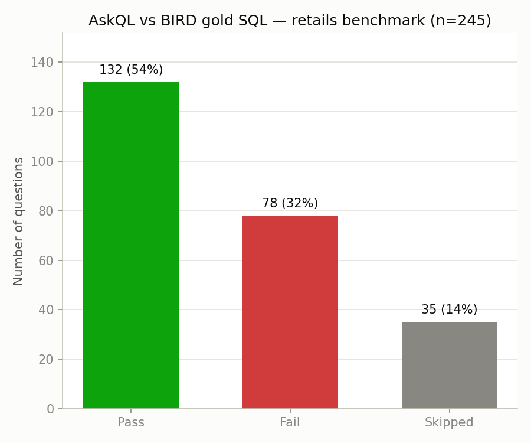

# AskQL Benchmark

Benchmarks AskQL against BIRD's `retails` database (a renamed copy of the classic
TPC-H schema: `customer`, `orders`, `lineitem`, `part`, `partsupp`, `supplier`,
`nation`, `region` — 150K customers, 1.5M orders, 4.4M lineitems) and its real
gold question/SQL pairs.

## Files

- `download_dataset.py` — downloads `retails.duckdb` (via `huggingface_hub`) and
  saves all 245 gold question/SQL pairs for `db_id='retails'` from BIRD's training
  set to `gold_questions.json`
- `benchmark.py` — runs every gold question through `BasicSQLAgent`, executes both
  AskQL's and the gold SQL against the same database, compares result values
  (order-independent, floats rounded to 2 decimals), and writes
  `question, gold_sql, askql_sql, pass` to `results.csv`
- `comparison_plot.py` — plots the pass/fail/skipped breakdown from `results.csv`
  to `results_plot.png`

Run in order: `download_dataset.py` → `benchmark.py` → `comparison_plot.py`.

## Findings (run against `qwen2.5-coder:14b` via Ollama)

Out of 245 gold questions: **132 passed, 78 failed, 35 skipped**.

**Skipped (35)**: the gold SQL itself uses SQLite-only syntax (e.g. `IIF(...)`)
that DuckDB doesn't support — these are a dataset/dialect mismatch, not an AskQL
issue, since the gold SQL never runs to produce an expected result to compare
against.

**Failed (78)**: we manually classified all of them by re-executing both queries:

| Category | Count |
|---|---|
| Extra/different column, core values otherwise correct | 2 |
| Same row count, different values (real bugs) | 42 |
| Different row count (real bugs) | 33 |
| Wrong columns selected entirely | 1 |

So only **2 of 78** failures are a comparison-method artifact (AskQL added an
extra column beyond what was asked). The other **76 are genuine SQL logic
errors**. Recurring patterns we found:

- **Wrong join key**: e.g. "nationality of Customer#55" joined
  `customer.c_name = 'Customer#000000055'` (comparing a literal against the wrong
  column) instead of following the actual foreign key to `nation`
- **Wrong aggregate direction**: "customer with the highest debt" should be
  `MIN(c_acctbal)` (most negative balance = most debt), AskQL used
  `ORDER BY c_acctbal DESC` (highest balance — the opposite)
- **Case-sensitivity bugs**: filtering `l_shipmode = 'truck'` when the actual
  stored value is `'TRUCK'`, silently returning 0 rows instead of erroring
- **Date-range/function mismatches**: gold's `STRFTIME('%Y', ...) = '1997'` vs.
  AskQL's `EXTRACT(YEAR FROM ...)` or `BETWEEN` sometimes disagreeing at the
  boundary
- **Ambiguous ties**: a few "top-1" (`LIMIT 1`) questions where gold and AskQL
  both return a *valid* row but a different one, because the true top value has
  ties and neither query specifies a tiebreaker

## Next Steps

- **Give the agent foreign key info.** `get_schema` currently introspects only
  column names/types via `information_schema.columns` — it has no idea
  `customer.c_nationkey → nation.n_nationkey`. Pulling FK constraints too (or at
  least documenting naming conventions) would directly fix the wrong-join-key
  failures.
- **Add explicit prompt guidance for aggregate direction and case sensitivity** —
  e.g. "when asked for 'highest debt' or similar negative-framed questions,
  reason about which end of the range that means" and "string filters should
  match case-insensitively unless the question implies otherwise, or inspect
  actual distinct values first."
- **Use BIRD's `evidence` field.** Each BIRD question ships with an `evidence`
  hint (e.g. clarifying what a column means or how to compute something) that the
  official BIRD benchmark provides to the model being evaluated. AskQL isn't
  using it at all right now — we're solving a harder version of the benchmark
  than intended. Wiring `evidence` into the prompt would likely fix several
  ambiguous/underspecified failures and produce a fairer comparison.
- **Try a bigger/different model** (e.g. GPT-4-class via OpenAI, or a larger
  Ollama model) to see how much of the 78 failures are model-capability-limited
  vs. schema/prompt-limited.